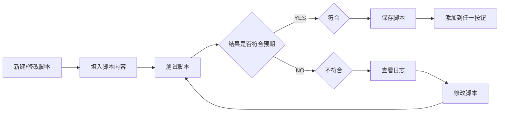

中文 | [English](https://github.com/lclrc/SquidExtender/blob/main/README_EN.md)


# SquidExtender

## 脚本(JavaScript)

### 一、版本3.5的改动须知

1. main函数**必须**为异步函数，即需要添加**async**关键词。
   比如在旧版中是：
```js
function main(str) {
   return str.split('').reverse().join('');
}
```
在新版中需要改为：
```js
async function main(str) {
    return str.split('').reverse().join('');
}
```
2. main函数返回值增加支持字典和字典数组，具体字典中需要哪些字段，[请查看](#3-字典)。
3. 扩展脚本能力，包括[打开应用](#4-app)，[打开链接(比如url scheme)](#3-url)，[联网请求](#8-http)，[读写剪贴板](#2-pb)，[base64编解码](#6-base64)，[md5编码](#5-md5)，[其他工具](#7-util)，[打印日志](#1-console)等。

### 二、脚本要求和调试技巧

#### **要求：**
1. 脚本内至少应包含一个函数名为main的异步async函数，可接收一个参数。执行时，将把文本内容作为参数传递给main函数
2. [main函数返回值](#三main函数的返回值)：可以是字符串，字符串数组，字典，字典数组。当返回字符串数组或字典数组时，将把数组中所有成员显示成多个选项以供选择。

#### **编写过程与技巧**
1. 如果有JavaScript或其他编程基础的可以手搓，没有基础的可以照猫画虎或借助GPT生成
   * GPT提示词示例：`实现一个javascript的函数名为main的异步async函数，接收一个字符串参数，把接收到的字符串经过处理后返回。
比如把接收的字符串经过以下处理，并返回。`
   * 问GPT要把一个大问题分解成几个小问题，掰开了问，不然它只会胡说。一步步问，如果不确定的话，每步之后用console.log()来打印日志，看处理之后是不是你想要的
2. 善用`console.log()`来打印变量并查看日志，[具体用法](#1-console)
3. 编写过程：



### 三、main函数的返回值

#### 1. 字符串

> 结果将直接插入到输入框。比如以下反转文字脚本：原始文本为`Hello World`，将输出`dlroW olleH`

```js
async function main(str) {
    return str.split('').reverse().join('');
}
```

#### 2. 字符串数组

> 数组中只有一个元素时，将直接插入到输入框；否则，将弹出选择菜单，选择某一项后，将插入到输入框。比如以下按换行分割脚本，假设原始文本为：

```
Hello
World
```
将弹出选择框，框内文本分别为`Hello`和`World`

可用于多条相关联信息保存在一条记录内，分割符可自选

```js
async function main(str) {
    arr = str.split("\n");
    arr.forEach((item, index)=>{
      if(!item){
          arr.splice(index, 1);
      }
    })
    return arr;
}
```

#### 3. 字典

> 字典中字段包括`type`(类型：**必要**)，`content`(内容：**必要**)，`title`(标题：非必要)。没有`title`字段时，将使用content字段作为标题。

比如以下写法都可以：
```js
async function main(str) {
    return {
      type: 'txt',
      title: 'insert ' + str,
      content: str,
    };
}
```
```js
async function main(str) {
    return {
      type: 'txt',
      content: str,
    };
}
```

##### 类型`type`可选项：

> txt，~~app~~，url，urlInApp，function，js

1. `txt`：插入文本
2. ~~`app`：打开应用。此时，content需要是某个应用的bundle identifier。比如：~~ 请使用打开url scheme代替。
3. `url`：在浏览器中打开链接。此时，content需要是有效的链接`http://`，`https://`或`url scheme`。比如：
```js
// 假设传入str为https://www.bing.com，执行后将打开Bing。
async function main(str) {
    return {
      type: 'url',
      content: str,
    };
}
```
4. `urlInApp`：在当前应用内打开链接，content要求同上。比如：
```js
// 假设传入str为https://www.bing.com，执行后将在当前应用打开Bing。
async function main(str) {
    return {
      type: 'urlInApp',
      content: str,
    };
}
```
5. `function`：执行javascript中某个async异步函数方法，content要求为函数名，最终执行结果支持[函数返回值](#三main函数的返回值)中的全部类型。另外有一个可选字段args，类型为数组，可以传递该方法需要的参数。比如：
```js
// 执行后将弹出菜单，选择某一项后，将插入处理后的文本插入到输入框。
async function main(str) {
	return [{
		type: 'function',
		content: 'myFunc1',
	},
	{
		type: 'function',
		content: 'myFunc2',
		args: ['text1', 'text2'],
	}];
}

async function myFunc1() {
    const res = await httpGetFunction();
    return `This is myFunc1: ${res}`;
}

async function myFunc2(arg1, arg2) {
    const res = await httpGetFunction();
    return `This is myFunc2: ${res}, ${arg1}, ${arg2}`;
}

async function httpGetFunction() {
  const baseURL = "https://httpbin.org/get";

  var headers = {
      'content-type': 'application/json;charset=UTF-8'
  }

  const req = {
      url: baseURL,
      headers: headers
  };
  const result = await $http.get(req); // 因为$http.get为async异步函数，执行需要时间，所以需要await关键词修饰来等待返回
  console.log("get result: type: " + typeof result + "\n" + result);

  resultJson = JSON.parse(result); // 使用JSON.parse(string)来解析获取到的内容
  console.log("get json: "+ resultJson);
  const resultObj = resultJson.origin;
  console.log("get some objects: "+ resultObj);

  return resultObj;
}
```
6. `js`(建议改用function，将来此类型可能会废弃)：执行javascript脚本，content要求为js语句。最终执行结果支持[函数返回值](#三main函数的返回值)中的全部类型。比如：
```js
// 执行后将先复制str的内容到剪贴板，再在当前应用中Bing，最后插入处理后的文本插入到输入框。(其中用到的$pb，$url等方法，后面介绍)
async function main(str) {
    return {
      type: 'js',
      content: `
$pb.writeString("${str}");
$url.openInApp("https://www.bing.com");
"${str}" + " Processed";
`,
    };
}
```


#### 4. 字典数组
> 数组中只有一个字典元素时，将直接执行字典中定义的动作；否则，将弹出选择菜单，选择某一项后，执行该字典中定义的动作。

比如：
```js
// 执行后将弹出三个选项，选择某一项后，将执行相应动作。
async function main(str) {
  return [
    {
      type: 'txt',
      title: 'insert: ' + str,
      content: str,
    },
    {
      type: 'url',
      title: 'open: ' + str,
      content: str,
    },
    {
      type: 'urlInApp',
      title: 'open in app: ' + str,
      content: str,
    }
  ];
}
```

#### 5. 无返回或无效返回
> 如果你只是想读写剪贴板，打开链接，打开应用，联网发送一些内容，而不需要把结果插入到输入框，可以返回`null`或`undefined`

```js
// 假设传入str为https://www.bing.com，执行后将在当前应用打开Bing。
async function main(str) {
    $pb.writeString(str);
    $url.open(str);
    return undefined;
}
```

### 四、扩展方法介绍
> 目前扩展有`$pb`(读写剪贴板)，`$url`(打开链接或url scheme)，`$app`(打开应用)，`$http`(联网请求)，`$md5`(MD5编码)，`$base64`(Base64编解码)，`console`(打印日志)，`util`(震动/声音反馈等)

#### 1. console

1. `console.log(obj)`：以字符串形式打印传入的值，方便调试。可在`测试脚本`后，在日志中查看。

```js
async function main(str) {
    console.log("传入了：" + str);
    const a = $pb.readString();
    console.log("当前剪贴板中文本：" + a);
    const b = $pb.readImage();
    console.log("当前剪贴板中图片：" + b);
    return undefined;
}
```

#### 2. $pb

1. `$pb.readString()`：读取剪贴板中的文本，返回值为字符串。
2. `$pb.writeString(str)`：将传入的字符串写入剪贴板，没有返回值。
3. `$pb.readImage()`：读取剪贴板中的图片，返回值为图像。
4. `$pb.writeImage(img)`：将传入的图像写入剪贴板，没有返回值。
5. `$pb.paste()`：执行粘贴动作，没有返回值。

```js
// 假设传入str为Bing。
async function main(str) {
    $pb.writeString(str + " copied"); // 将处理后的字符串写入剪贴板
    const result = $pb.readString(); // 将剪贴板中文本赋值给result
    $pb.paste(); // 将执行粘贴动作
    return null;
}
```

#### 3. $url

1. `$url.open(str)`：在浏览器中打开传入的链接或url scheme，没有返回值。(前提：传入str为有效链接)

```js
// 假设传入str为https://www.bing.com。
async function main(str) {
    $url.open(str); // 在浏览器中打开bing
    return null;
}
```
2. `$url.openInApp(str)`：在当前应用中打开传入的链接，没有返回值。(前提：传入str为有效链接)

```js
// 假设传入str为https://www.bing.com。
async function main(str) {
    $url.openInApp(str); // 在当前应用中打开bing
    return null;
}
```

#### 4. $app

1. ~~`$app.open(str)`：打开bundle identifier对应的应用，没有返回值。~~  请使用打开url scheme代替

#### 5. $md5

1. `$md5.encode(obj)`：对字符串或图像进行MD5编码，返回其MD5值。常用于网络中校验

```js
async function main(str) {
    if (str == "") { // 如果传入了空字符串，将先尝试读取剪贴板中的图片，进行编码
    const image = $pb.readImage();
    // console.log("1: " + image);
    if (image !== null && image !== undefined) {
      return $md5.encode(image);
    } else { // 如果剪贴板中没有图片，将读取剪贴板中的字符串，进行编码
      const string = $pb.readString();
      if (string !== null && string !== undefined && string !== "") {
        // console.log("2: " + string);
        return $md5.encode(string);
      }
    }
  } else { // 对输入框中文字进行编码
    console.log("3: " + str);
    return $md5.encode(str)
  }
}
```

#### 6. $base64

1. `$base64.encode(obj)`：对字符串或图像进行Base64编码，返回其Base64值。常见于网络中传输
2. `$base64.decode(str)`：对Base64格式字符串进行Base64解码，返回其实际值。常见于网络中传输

```js
async function main(str) {
    const a = $base64.encode(str);
    console.log(a);
    const b = $base64.decode(a);
    console.log(b);
    return a;
}
```

#### 7. $util

1. `$util.feedback(type)`：`type`目前可选值有`haptic`，`sound`

```js
async function main(str) {
    $util.feedback("haptic"); // 执行一次震动反馈
    $util.feedback("sound"); // 执行一次音效反馈
    return "executed";
}
```

#### 8. $http
> 由于网络请求不能立即返回，所以需要在调用时，使用await关键词设置为等待收到请求的数据之后再继续执行，用法参考示例

1. `$http.get(dict)`：GET请求。传入的dict为字典，包括字段`url`，`headers`
- url(必填)：为完整的网址字符串，如果网址中包含中韩日文或标点等特殊字符，需要使用`encodeURI(url)`进行URL编码
- headers(非必填)：为字典。有些网址需要置顶请求头参数
2. `$http.post(dict)`：POST请求。传入的dict为字典，包括字段`url`，`body`，`headers`
- url(必填)：为完整的网址字符串，如果网址中包含中韩日文或标点等特殊字符，需要使用`encodeURI(url)`进行URL编码
- body(非必填)：为需要post的数据
- headers(非必填)：为字典。有些网址需要置顶请求头参数
3. `$http.put(dict)`：PUT请求
4. `$http.patch(dict)`：PATCH请求
5. `$http.delete(dict)`：DELETE请求

##### (1) get请求示例

```js
// get请求示例
async function main(str) {
   const x = await myFunc(); // 因为myFunc为async异步函数，需要await关键词修饰来等待返回
   console.log("return result: "+ x);
   return x;
}

async function myFunc() {
   const baseURL = "https://httpbin.org/get";

   var headers = {
      'content-type': 'application/json;charset=UTF-8'
   }

   const req = {
      url: baseURL,
      headers: headers
   };
   const result = await $http.get(req); // 因为$http.get为async异步函数，执行需要时间，所以需要await关键词修饰来等待返回
   console.log("get result: type: " + typeof result + "\n" + result);

   resultJson = JSON.parse(result); // 使用JSON.parse(string)来解析获取到的内容
   console.log("get json: "+ resultJson);
   const resultObj = resultJson.origin;
   console.log("get some objects: "+ resultObj);

   return resultObj;
}
```

##### (2) post请求示例

```js
// post请求示例
async function main(str) {
   const x = await myFunc(); // 因为myFunc为async异步函数，需要await关键词修饰来等待返回
   console.log("return result: "+ x);
   return x;
}

async function myFunc() {
   const baseURL = "https://httpbin.org/post";

   var headers = {
      'content-type': 'application/json;charset=UTF-8'
   }

   const data = {
      page_num: 1,
      page_size: 100,
      username: 'admin'
   };
   const req = {
      url: baseURL,
      headers: headers,
      body: JSON.stringify(data)
   };
   const result = await $http.post(req); // 因为$http.get为async异步函数，执行需要时间，所以需要await关键词修饰来等待返回
   console.log("get result: type: " + typeof result + "\n" + result);

   resultJson = JSON.parse(result); // 使用JSON.parse(string)来解析获取到的内容
   console.log("get json: "+ resultJson);

   const resultObj = resultJson.json.page_size;
   console.log("get some objects: "+ resultObj);

   return resultObj;
}
```

##### (3) 根据文字生成二维码并粘贴示例

```js
// 根据输入框中文字或剪贴板中文字联网获取二维码图片，并自动粘贴示例
async function main(str) {
   if(str == "") {
      str = $pb.readString();
   }
   const image = await getQR(str);
   console.log("image: " + image);
   $pb.writeImage(image);
   $pb.paste();

   return null;
}

async function getQR(str) {
   const baseURL = "https://api.qrtool.cn/?text=" + str;

   var headers = {
      'accept': 'application/json;charset=UTF-8'
   }

   // 由于输入文字可能有中韩日文或标点等特殊字符，所以使用encodeURI()进行一次URL编码
   const req = {
      url: encodeURI(baseURL),
      headers: headers
   };
   const result = await $http.get(req);
   console.log("get result: "+ result);

   return result;
}
```

### 五、其他一些示例

#### 1. 转为MD项目列表
比如：原始文本为`Hello World`，将输出`- Hello World`

```js
async function main(str) {
   const bullet = '-';
   return `${bullet} ` + str.split(/\r?\n/).join(`\n${bullet} `);
}
```

#### 2. GitHub转换raw链接
比如：原始文本为`https://raw.githubusercontent.com/lclrc/CopyVault/main/README_EN.md`，将输出`https://github.com/blob/lclrc/CopyVault/main/README_EN.md`

```js
async function main(url) {
   // 处理字符串，将 "raw.githubusercontent.com" 替换为 "github.com/blob"
   const processedUrl = url.replace("raw.githubusercontent.com", "github.com/blob");
   // 创建一个字符串数组
   const urls = [];
   // 将处理后的字符串添加到数组中
   urls.push(processedUrl);
   // 返回字符串数组
   return urls;
}
```

#### 3. 转换为大写
比如：原始文本为`Hello World`，将输出`HELLO WORLD`

```js
async function main(str) {
   // 创建一个字符串数组
   const strs = [];
   // 处理字符串，转换为大写
   const processedStr = str.toUpperCase();
   // 将处理后的字符串添加到数组中
   strs.push(processedStr);
   // 返回字符串数组
   return strs;
}
```
#### 4. 去掉全部空格
比如：原始文本为`Hello World`，将输出`HelloWorld`

```js
async function main(str) {
   // 创建一个字符串数组
   const strs = [];
   // 处理字符串，去除所有空格
   const processedStr = str.replace(/\s/g, "");
   // 将处理后的字符串添加到数组中
   strs.push(processedStr);
   // 返回字符串数组
   return strs;
}
```

#### 5. 去掉首尾空格
比如：原始文本为`  Hello World `，将输出`Hello World`

```js
async function main(str) {
   // 创建一个字符串数组
   const strs = [];
   // 处理字符串，去除首尾空格
   const processedStr = str.trim();
   // 将处理后的字符串添加到数组中
   strs.push(processedStr);
   // 返回字符串数组
   return strs;
}
```

#### 6. 中文排版(在中英字符、数字、标点和货币符号之间添加空格)
> From 阿立

```js
async function main(text) {
   // 使用正则表达式匹配并在中英字符、数字、标点和货币符号之间添加空格
   return text.replace(/([\u4e00-\u9fa5])([a-zA-Z0-9¥$€£₹₩₽₺₨₦₫₴₭₲₡₣₤₱])/g, '$1 $2')
           .replace(/([a-zA-Z0-9¥$€£₹₩₽₺₨₦₫₴₭₲₡₣₤₱])([\u4e00-\u9fa5])/g, '$1 $2')
           .replace(/([\u4e00-\u9fa5])([,.!?;:¥$€£₹₩₽₺₨₦₫₴₭₲₡₣₤₱])/g, '$1$2')
           .replace(/([,.!?;:¥$€£₹₩₽₺₨₦₫₴₭₲₡₣₤₱])([\u4e00-\u9fa5])/g, '$1 $2');
}
```

#### 7. 复制抖音评论去除用户名
> From 阿立

```js
async function main(text) {
   // 使用正则表达式匹配并删除 ^@.*: 部分
   const regex = /^@.*?:/gm;
   const cleanedText = text.replace(regex, '').trim();

   return cleanedText;
}
```

#### 8. 哔哩哔哩RSS 复制UID
> From 阿立

```js
async function main(text) {
   const regex = /UID:(\d+)/g;
   let match;
   const results = [];
   const prefix = "https://rsshub.app/bilibili/user/dynamic/";

   while ((match = regex.exec(text)) !== null) {
      results.push(prefix + match[1]);
   }

   return results.length === 1 ? results[0] : results;
}
```

#### 9. 精简App Store分享链接
> From 阿立

```js
async function main(url) {
   // 使用正则表达式提取国家代码和ID部分
   const regex = /https:\/\/apps\.apple\.com\/([a-z]{2})\/app\/.*\/id(\d+)/;
   const match = url.match(regex);

   if (match) {
      // 构建精简后的链接
      const countryCode = match[1];
      const appId = match[2];
      const simplifiedUrl = `https://apps.apple.com/${countryCode}/app/id${appId}`;
      return simplifiedUrl;
   } else {
      return "Invalid URL";
   }
}
```

#### 10. 删除多余的空行段落
> From 阿立

```js
function removeEmptyLines(text) {
   return text.split('\n').filter(line => line.trim() !== '').join('\n');
}

async function main(text) {
   return removeEmptyLines(text);
}
```